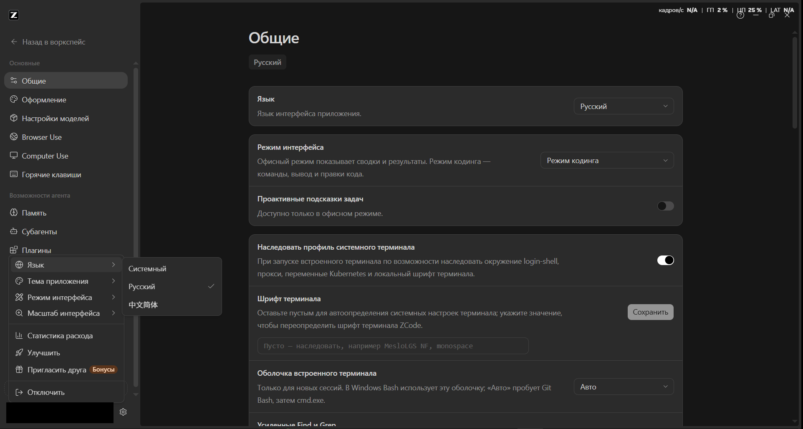

# ZCode Russifier — Russian UI for ZCode Desktop

[](https://github.com/xISPx/zcode-russifier/releases)
[](https://github.com/xISPx/zcode-russifier)
[](https://nodejs.org/)
[](LICENSE)
[](https://zcode.z.ai)

**[Русский](README.md) | English**

Unofficial Russian UI translation (russifier) for [ZCode Desktop](https://zcode.z.ai), the Windows desktop app. The app officially ships with English and Chinese only; this script adds Russian by rewriting the English UI strings inside `app.asar`.



**All 6119 catalog strings translated (v3.14.3) — 100% coverage.** Server-driven campaign popups (e.g. the "Entitlement Rules" quota-coefficient dialog) are translated too — their text arrives from the Z.ai API, so the russifier maps it at render time. The only intentionally English strings are model-facing ones: skill descriptions and agent service prompts (translating them hurts AI quality). Covered sections:

- sidebar, task list and task groups;
- chat: composer, message actions, greetings, preview cards, tool-call cards, queues, quotas, permissions, Computer Use;
- app menu, command center, command palette;
- agent modes (Plan, Accept edits, Full access, etc.);
- **the entire Settings area**: model providers, MCP servers, Coding Plan and payments, skills, subagents, plugins, commands, hooks, browser, memory, indexing, Computer Use;
- automations (scheduled tasks), idle-time tasks, and their template cards;
- mobile remote control, bots page (Telegram / Weixin / Feishu / webhooks);
- SSH and WSL connections, the native menu, update dialogs and About;
- Git panel and Git graph, repo wiki, model trajectory, whiteboards, feedback center, conversation sharing, resource manager.

> Strings that are sent **to the model** (skill descriptions, agent service prompts) stay English on purpose — it keeps the AI working at full quality. Plan tier names are translated (Лайт / Про / Макс); service and channel names (Telegram, Feishu…) stay as-is.

> ⚠️ **Important**
> - This modifies application files — use at your own risk.
> - **ZCode auto-updates wipe the russification.** Just run the script again after every update.
> - Roll back any time: update or reinstall ZCode — its installer restores the original `app.asar`.
> - Tested on **3.11.2, 3.12.3, 3.14.0–3.14.3 (Windows x64)**. The script locates chunks by pattern, so nearby versions usually work too; it will tell you if the structure changed too much.

---

## Requirements

- Windows
- [Node.js](https://nodejs.org/) 18 or newer (check with `node -v`)
- ZCode Desktop installed

## Applying the Russian language

Download the repository (**Code → Download ZIP**, then unpack) or clone it:

```
git clone https://github.com/xISPx/zcode-russifier.git
cd zcode-russifier
```

Then one command:

```
node russify.js
```

The script finds ZCode in `%LOCALAPPDATA%\Programs\ZCode`, patches `app.asar` and prints a report. Restart ZCode — the interface is now Russian.

If ZCode lives somewhere else, pass the path as an argument:

```
node russify.js "D:\Programs\ZCode"
```

Closing ZCode first is **not required**: the script can overwrite the archive in place while the app is running (Russian appears after a restart).

Double-clicking `run.cmd` does the same as `node russify.js` (Node must be in PATH).

### Setup .exe (build your own)

No prebuilt .exe is distributed. You can build one yourself from the `installer/russifier.sed` recipe — the package is built by the IExpress tool built into Windows and bundles its own `node.exe`, so the resulting setup runs on machines without Node:

```
iexpress /N installer\russifier.sed
```

## How it works

The app has exactly two UI locales — `en-US` and `zh-CN` — and hard logic "system language starts with zh → Chinese, otherwise English". There is no separate locale file; strings are compiled into minified code. So the russifier:

1. parses the `app.asar` header and locates the renderer string catalog (the `IntlProvider-*.js` chunk), the native menu map and the main-process dialogs;
2. replaces English values with Russian ones from the `translations` folder (placeholders like `{count}` are validated — a translation with mismatched placeholders is dropped);
3. recomputes SHA-256 integrity for the changed files and appends them to the archive, keeping every other file at its original offset;
4. swaps `app.asar` (if the running app holds the file, it overwrites in place — the old layout stays compatible).

No need to touch the language setting in the app: the English locale itself is russified, and it is the default.

## Rollback

Any of these:

- update ZCode (Help → Check for updates) — its installer restores the original archive;
- reinstall ZCode.

## After a ZCode update

The russification is gone — expected. Grab the latest version of this repository and run `node russify.js` again. If the developers change the app structure significantly, the script will say so — watch the issues for russifier updates.

## Repository layout

```
russify.js           — the russification script (run this)
run.cmd              — same thing via double-click (Node in PATH)
translations/        — dictionaries (JSON: key → Russian string)
installer/           — recipe for building the optional setup .exe (IExpress)
screenshots/         — README illustrations
```

Dictionaries are easy to extend: take a missing key from the catalog and add `"key": "translation"` to any JSON in `translations/`. Only UI is translated; model-facing strings stay English by design.

## Troubleshooting

- **"Не найден app.asar" (app.asar not found)** — ZCode is installed elsewhere; pass the path as an argument.
- **Checksum mismatch** — your ZCode version differs a lot; open an issue.
- **Nothing changed after running** — restart ZCode completely (tray icon → Quit, then launch).
- **Some strings are still English** — by design: brand names, language labels, and model-facing strings. Features added by the developers after the latest russifier update show up in English until the dictionaries are updated.

## License

[MIT](LICENSE). ZCode is a trademark of its respective owners; this project is not affiliated with the ZCode developers.
